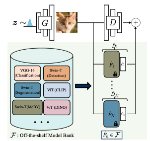
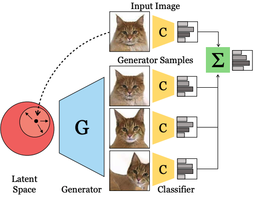
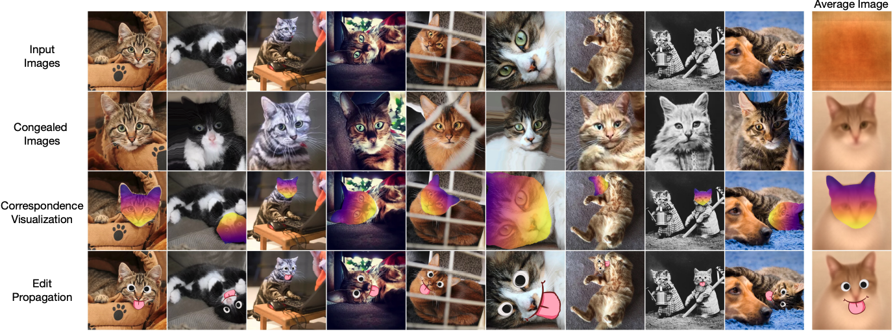
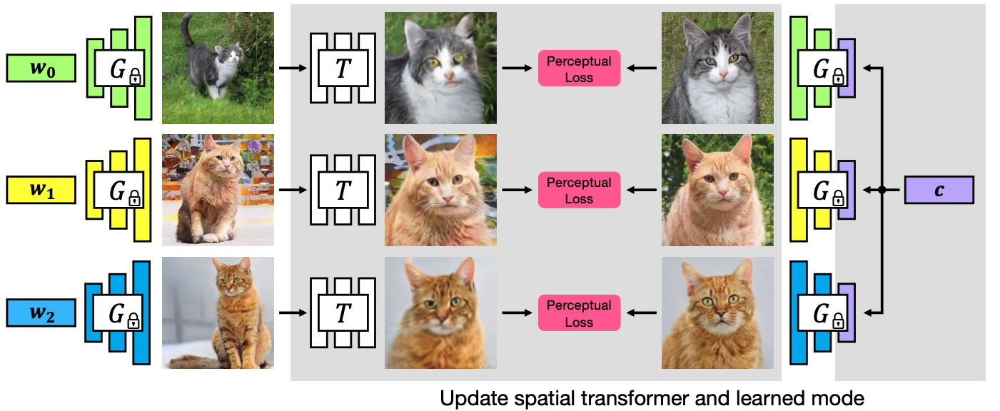
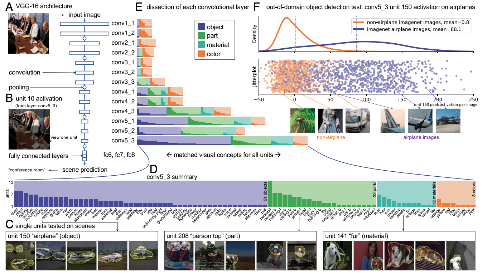
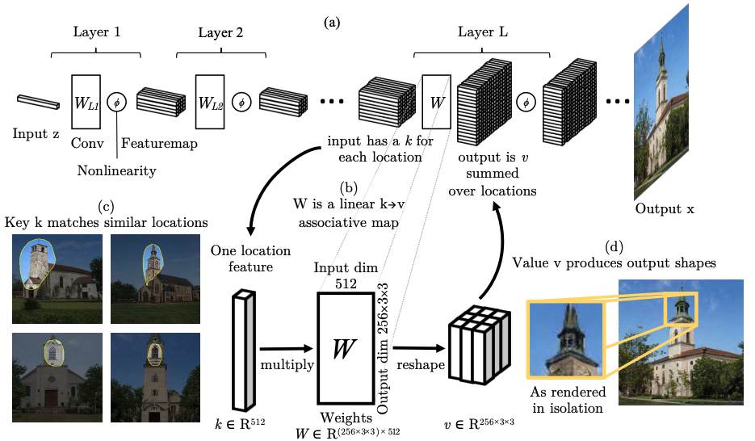
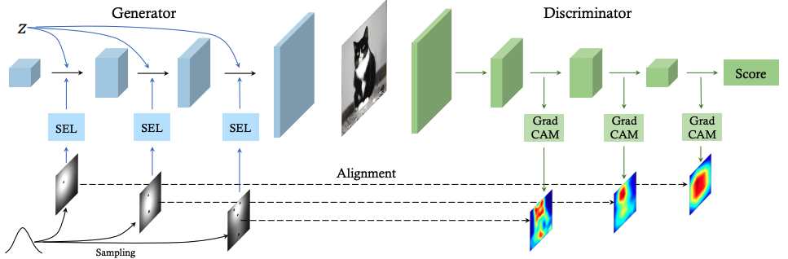

# Paper_notes
This repository contains the paper notes for medical image, computer vision or any other area.
This repository is regarded as a notebook. Please feel free to correct me. 

## Rethinking 
1. [Rethinking the hyperparameters for fine-tuning](https://arxiv.org/pdf/2002.11770.pdf)  
   Content: 本文讲了超参数的选择对fine-tune的影响，主要包含学习率、动量和正则项。其中一点，pretrained model的数据集domain (source domain) 与fine-tune数据集domain (target domain)的差距会影响着超参数的选择，尤其是学习率和动量。当source domain和target domain差距很大时，则要用较小的动量，even m=0；反之，则较大的动量（0.9）。这意味着source domain和target domain之间存在着一定的gap，所以才要根据这个gap给定不同的动量来fine-tune。后面还讲到了最优的学习率的结论，也和上述相似。 
   idea：那么，我们在做医疗图像的任务时，我们会用pretrained on ImageNet的网络，但是医疗图像和自然图像实在有比较大的差异。 
         (1) 这个gap该如何填充？ 
         (2) 我们应该找一个医疗图像的数据集重新训练一下，缩小这个gap？最后在我们的数据集上fine-tune？ 
         (3) 还是应该做一个医疗图像自己的pretrained model？ 
         还有一个问题，还是说我们应该投入精力在hyperparameters的search上？做自动的超参数查找？ 
         
## Seeded segmentation
首先，seeded segmentation在医疗图像真的很重要吗？
1. 

## Transformer for Computer Vision

越来越多的工作利用transformer来解决CV的问题，例如目标检测、face anti-spoofing和图像分类等等。利用了transformer能够学习不同patch间联系的能力，因此，在医疗图像上是否也可以使用？
1. [An Image is Worth 16x16 Words: Transformers for Image Recognition at Scale](https://openreview.net/forum?id=YicbFdNTTy)

2. [How to augment your ViTs? Consistency loss and StyleAug, a random style transfer augmentation](https://arxiv.org/pdf/2112.09260.pdf)
该论文提出如何通过一些CNN中数据增强的technique去提升ViTs的性能。主要包括基于风格迁移的数据增强，以及增强图像的预测结果的consistency loss。
augmented consistency loss: (1) classic version: Loss = CE(f(x_aug), label) (2) JSD version: Loss = CE(f(x_orig), label) + λ JSD(f(x_orig)|| f(x_aug1
)|| f(x_aug2))

3. [StyleSwin: Transformer-based GAN for High-resolution Image Generation](https://arxiv.org/pdf/2112.10762v1.pdf)
该论文提出了类似stylegan框架但由transformer block组成生成网络。其性能超过stylegan2。

4. [On Efficient Transformer and Image Pre-training for Low-level Vision](https://arxiv.org/pdf/2112.10175v1.pdf)
该论文提出了新的基于encoder-decoder-based transformer的架构。在不同的任务间，有不同的encoder-deocder pair，但是共享同一个transformer stage，从而利用其他任务达到预训练transformer stage的目的。

5. [The Nuts and Bolts of Adopting Transformer in GANs](https://arxiv.org/pdf/2110.13107.pdf?ref=https://githubhelp.com) 
该论文提出了一个关于GAN的transformer的网络结构，减少了artifacts。 

## Image Translation

//该论文提出利用一个预定义的mask让网络选择性的优化mask的部分。在SR中，我们也可以用mask将前景和背景分离，分开predict。

## Domain adaptation
1. [ONE-SHOT GENERATIVE DOMAIN ADAPTATION](https://arxiv.org/pdf/2111.09876.pdf) 
该论文目标是实现一个zero-shot的DA生成模型。如图，先训练一个GAN学习source domain的图像生成；接着，利用一个adaptor将输入的feature映射到target domain的feature；而此时，判别器还不具备分类target domain的能力，因此在判别器后加一个分类器。该模型可以在大量数据的预训练模型上finetune，保持了原本模型所学得的基本pattern，还可以减少训练的时间。 

## GAN
1. [Ensembling Off-the-shelf Models for GAN Training](https://arxiv.org/pdf/2112.09130.pdf)  
在判别器中，ensemble多个pretrained model的特征，来提升其判别能力，从而提升生成图像的质量。 

2. [Ensembling with Deep Generative Views](https://arxiv.org/pdf/2104.14551.pdf) 
与论文1相对应，针对生成器的结果进行ensemble，从而提升分类器的性能。该文中，先把图像映射到一个latent vector,针对这个vector加入一些小的扰动，再重新输入到图像中，得到不同的图片。接着，把这些生成的图像分别输入到分类其中，再将其结果进行ensemble，作为最终的结果。 

3. [GAN-Supervised Dense Visual Alignment](https://arxiv.org/pdf/2112.05143.pdf) 
该论文中，希望网络学习到目标图像的形状的位置，如猫头的位置，从而进行下一步的图像编辑。这里为了猫的形状，利用了一个spatial transformer network 来学习输入图像的形变参数，从而根据形变参数获得位置关系。在训练STN时，固定生成器的参数，利用peceptual loss计算生成图像和目标图像的距离，使得STN学习到最好的形变参数。
 

4. [Understanding the role of individual units in a deep
neural network](https://www.pnas.org/content/pnas/117/48/30071.full.pdf) 
该论文中，分析了VGG16/GAN网络中不同层参数学习到的信息，包括物体形状、区域、材质和颜色。 

5. [Rewriting a Deep Generative Model](https://arxiv.org/pdf/2007.15646.pdf) 
该论文认为网络的权重在学习一些跟pattern相关的规则，通过缩小目标pattern和输入区域的特征差异，从而达到替换目标pattern的目的。 

6. [Improving GAN Equilibrium by Raising Spatial Awareness](https://arxiv.org/pdf/2112.00718.pdf)  
本文提出了利用GradCAM提取判别器的热力图，从而向生成器提供一些空间信息，最终提升GAN的平衡 

7. [Positional Encoding as Spatial Inductive Bias in GANs](https://arxiv.org/pdf/2012.05217.pdf)  
在GAN的编码过程中，存在一些空间bias，而这些bias是由zero padding带来的。 

8. [STYLEALIGN: ANALYSIS AND APPLICATIONS
OF ALIGNED STYLEGAN MODELS](https://openreview.net/pdf?id=Qg2vi4ZbHM9)(ICLR 2022) 
现有的图像编辑的工作中，有许多基于StyleGAN进行fine-tune的方法，实质上就是迁移学习。该论文分析了这些方法是如何继承父模型的参数，在finetune过程中又是如何修改这些参数的。 
 
## Self-Supervised Representation Learning

1. [Self-Distilled Self-Supervised Representation Learning](https://arxiv.org/pdf/2111.12958.pdf)
这篇论文介绍了如何提升互信息的upper bound。首先，两张图像的最大互信息肯定是他们的content C。其次，因为随着网络层数增加，其提到的特征就更加抽象，和content偏移也就更远，所以默认浅层的feature f1_l相比深层的feature f1_L更加接近content。因此，作者认为I(f1_L, f2_L) <= I(f1_l, f2_L), （I表示互信息），即深层之间的互信息 小于 浅层和深层间的互信息。进而认为，I(f1_l, f2_L)这便是互信息的上界。

2. [Are Large-scale Datasets Necessary for Self-Supervised Pre-training?](https://arxiv.org/pdf/2112.10740v1.pdf)
这篇论文应该是Masked auto-endocder那篇文章的延伸。在同样的框架上，同样的图片输入encoder，decoder分别输入两个不同的masked encoded features，并重构其masked的部分。重构后，两个不同的结果计算互信息损失，提升特征的相似性。该方法在COCO上pretrained的效果竟然比在imagenet的效果有比较大的提升。

## Data Bias

1. [MITIGATING THE BIAS OF CENTERED OBJECTS IN COMMON DATASETS](https://arxiv.org/pdf/2112.09195.pdf) 
该论文希望通过一种新的数据增强的方式缓解物体位于中心的bias。

## Basic Components for Training
1. [ADAPTIVELY CUSTOMIZING ACTIVATION FUNCTIONS FOR VARIOUS LAYERS](https://arxiv.org/pdf/2112.09442.pdf) 
该论文提出了一个自适应的激活函数，用于提高收敛速度和性能。例子如下： 
ASimoid : fAsimoid = biSigmoid(aiz + ci) + di 
ATanh : fAtanh = bitanh(aiz + ci) + di 
AReLU : fArelu = maximum(aiz + ci, biz + di)  

## Lifelong learning
1. [AN EMPIRICAL INVESTIGATION OF THE ROLE OF PRETRAINING IN LIFELONG LEARNING](https://arxiv.org/pdf/2112.09153.pdf) 
This paper found that lifelong learning methods should focus on learning generic features instead of simply focusing on alleviating catastrophic forgetting, as generic features appear to undergo minimal forgetting. 

## CLIP
1. [Align and Prompt: Video-and-Language Pre-training with Entity Prompts](https://arxiv.org/pdf/2112.09583.pdf) 
该论文介绍了一个视频文字的与训练框架。在预训练的过程中，通过对齐视频和文字中的多个实体，来提升在下游任务中的性能。相比现有的方法，它不需要检测器，这是关键的地方。

2. [GLIDE: Towards Photorealistic Image Generation and Editing with Text-Guided Diffusion Models](https://arxiv.org/pdf/2112.10741v1.pdf) 
该论文介绍了一个可以根据文字和mask编辑图像的网络。

## Knowledge Distillation
1. [Pixel Distillation: A New Knowledge Distillation Scheme for Low-Resolution Image Recognition](https://arxiv.org/pdf/2112.09532.pdf) 
本文的动机是希望（1）在降低模型输入图像的分辨率的同时，还能保证低分辨率图像特征和高分辨率图像特征相似，另外（2）还希望能够达到压缩模型参数的目的。 
因此，为了动机（2）该论文提出了除了老师和学生模型以外，还提出加入一个助教模型，用于减少模型的参数；为了动机（1）本文提出了在学生和助教模型之间进行像素级的知识蒸馏，保证特征表示与高分辨率的特征一致。

## Medical Image Analysis
1. [Unified 2D and 3D Pre-training for Medical Image Classification and Segmentation](https://arxiv.org/pdf/2112.09356.pdf) 
该论文提出了打破2d和3d的gap，并且先在两种数据上先预训练，然后各自下游任务上再fine tune。 

## RL
1. [Off-Policy Reinforcement Learning for Efficient
and Effective GAN Architecture Search](https://www.ecva.net/papers/eccv_2020/papers_ECCV/papers/123520171.pdf) 
如题，本文讲了如何利用RL搜索GAN的结构。 
